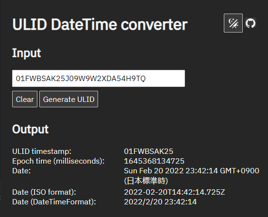

# ULID / UUID v7 Timestamp Converter

[ULID](https://github.com/ulid/spec) / [UUID v7](https://www.rfc-editor.org/rfc/rfc9562) <-> Timestamp Converter

See the website: <https://ugai.github.io/ulid-timestamp-converter/>

## Screenshot

